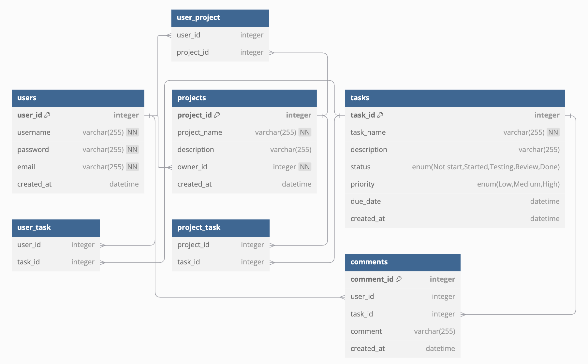

### Database Schema Design

         

1. **Users Table**:
   - Stores user credentials and roles.
   - Uses `AUTOINCREMENT` for `user_id` to automatically generate unique IDs.
   - Columns: 
      - `user_id`: INTEGER PRIMARY KEY
      - `username`: varchar(255) NOT NULL
      - `password`: varchar(255) NOT NULL
      - `email`: varchar(255) NOT NULL
      - `created_at`: DATETIME
  

2. **Projects Table**:
   - Contains details about each project, linking the owner to the `Users` table.
    - Columns: 
      - `project_id`: INTEGER PRIMARY KEY
      - `project_name`: varchar(255) NOT NULL
      - `description`: varchar(255)
      - `owner_id`: INTEGER NOT NULL (References Users)
      - `created_at`: DATETIME

3. **ProjectMembers Table**:
   - Manages the relationship between users and projects, allowing multiple users to join a project.
   - The `UNIQUE` constraint prevents duplicate user entries in the same project.
   - Columns: 
      - `task_id`: INTEGER PRIMARY KEY
      - `taks_name`: varchar(255) NOT NULL
      - `project_id`: INTEGER NOT NULL (References Projects)
      - `description`: varchar(255)
      - `status`: enum('Not start', 'Started', 'Testing', 'Review', 'Done')
      - `priority`: enum('Low', 'Medium', 'High')
      - `due_date`: DATETIME
      - `created_at`: DATETIME

4. **UserProject Table** (Junction table for Users-Projects many-to-many relationship):
   - `user_id`: INTEGER (References Users)
   - `project_id`: INTEGER (References Projects)

5. **UserTask Table** (Junction table for Users-Tasks many-to-many relationship):
   - `user_id`: INTEGER (References Users)
   - `task_id`: INTEGER (References Tasks)

6. **ProjectTask Table** (Junction table for Projects-Tasks many-to-many relationship):
   - `project_id`: INTEGER (References Projects)
   - `task_id`: INTEGER (References Tasks)

7. **Comments Table**:
   - `user_id`: INTEGER (References Users)
   - `task_id`: INTEGER (References Tasks)
   - `comment`: varchar(255)
   - `created_at`: DATETIME


### SQLite Database Schema Design
```
-- Users table
CREATE TABLE Users (
    user_id INTEGER PRIMARY KEY AUTOINCREMENT,
    username VARCHAR(255) NOT NULL UNIQUE,
    password VARCHAR(255) NOT NULL,
    email VARCHAR(255) NOT NULL UNIQUE,
    created_at DATETIME DEFAULT CURRENT_TIMESTAMP
);

-- Projects table
CREATE TABLE Projects (
    project_id INTEGER PRIMARY KEY AUTOINCREMENT,
    project_name VARCHAR(255) NOT NULL,
    description VARCHAR(255),
    owner_id INTEGER NOT NULL,
    created_at DATETIME DEFAULT CURRENT_TIMESTAMP,
    FOREIGN KEY (owner_id) REFERENCES Users(user_id) ON DELETE CASCADE
);

-- Tasks table
CREATE TABLE Tasks (
    task_id INTEGER PRIMARY KEY AUTOINCREMENT,
    taks_name VARCHAR(255) NOT NULL,
    project_id INTEGER NOT NULL,
    description VARCHAR(255),
    status TEXT CHECK(status IN ('Not start', 'Started', 'Testing', 'Review', 'Done')) DEFAULT 'Not start',
    priority TEXT CHECK(priority IN ('Low', 'Medium', 'High')) DEFAULT 'Medium',
    due_date DATETIME,
    created_at DATETIME DEFAULT CURRENT_TIMESTAMP,
    FOREIGN KEY (project_id) REFERENCES Projects(project_id) ON DELETE CASCADE
);

-- UserProject junction table
CREATE TABLE UserProject (
    user_id INTEGER NOT NULL,
    project_id INTEGER NOT NULL,
    FOREIGN KEY (user_id) REFERENCES Users(user_id) ON DELETE CASCADE,
    FOREIGN KEY (project_id) REFERENCES Projects(project_id) ON DELETE CASCADE,
    PRIMARY KEY (user_id, project_id)
);

-- UserTask junction table
CREATE TABLE UserTask (
    user_id INTEGER NOT NULL,
    task_id INTEGER NOT NULL,
    FOREIGN KEY (user_id) REFERENCES Users(user_id) ON DELETE CASCADE,
    FOREIGN KEY (task_id) REFERENCES Tasks(task_id) ON DELETE CASCADE,
    PRIMARY KEY (user_id, task_id)
);

-- ProjectTask junction table
CREATE TABLE ProjectTask (
    project_id INTEGER NOT NULL,
    task_id INTEGER NOT NULL,
    FOREIGN KEY (project_id) REFERENCES Projects(project_id) ON DELETE CASCADE,
    FOREIGN KEY (task_id) REFERENCES Tasks(task_id) ON DELETE CASCADE,
    PRIMARY KEY (project_id, task_id)
);

-- Comments table
CREATE TABLE Comments (
    comment_id INTEGER PRIMARY KEY AUTOINCREMENT,
    user_id INTEGER NOT NULL,
    task_id INTEGER NOT NULL,
    comment VARCHAR(255) NOT NULL,
    created_at DATETIME DEFAULT CURRENT_TIMESTAMP,
    FOREIGN KEY (user_id) REFERENCES Users(user_id) ON DELETE CASCADE,
    FOREIGN KEY (task_id) REFERENCES Tasks(task_id) ON DELETE CASCADE
);

-- Create indexes for better query performance
CREATE INDEX idx_users_email ON Users(email);
CREATE INDEX idx_tasks_project ON Tasks(project_id);
CREATE INDEX idx_comments_task ON Comments(task_id);
